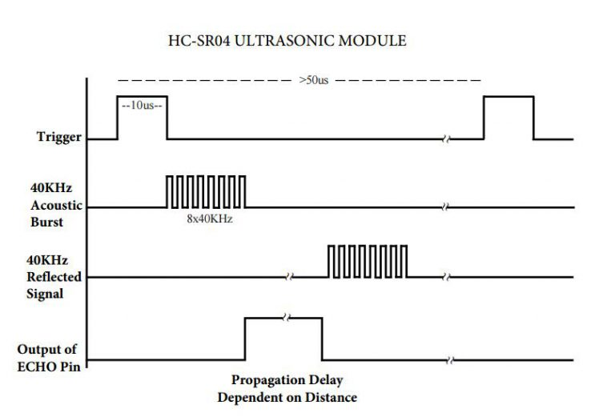

====================================================
BitBotXL distance sensor
====================================================

HC_SR04P
--------------

For general info on the HC_SR04P distance sensor, see: https://shop.4tronix.co.uk/products/hc-sr04p-low-voltage-ultrasonic-distance-sensor

.. image:: images/ultrasonic-sensor-for-bitbot-xl.png
    :scale: 50 %
    :align: center
    :alt: HC_SR04P

See: https://shop.4tronix.co.uk/collections/robobit/products/ultrasonic-breakout

| There are two "eyes" on the sensors. The left eye is the Trigger/transmitter which sends the pulse of ultrasound forwards. When the ultrasound hits an obstacle it may bounce back and be received by the Echo/Receiver eye.
| The sensor is connected via a single pin, 3.3V. So the Trigger and the Echo are on the same pin.
| Sensor angle: 15 degrees
| Range: 2cm - 450cm
| Resolution: 0.3cm
| Output a 10us (us = microsecond) HIGH signal to Trigger input to start the detection
| Measure the length of pulse received on Echo output to determine distance
| Distance is pulse time * speed of sound / 2
| The speed of sound is about 343m/s or 34300cm/s or 0.0343 cm/µs (centimeter per microsecond).

.. Note::
    
    | The symbol for microseconds is ``µs``.
    | This uses the greek letter ``µ``, which represents 1/1000000, one millionth.
    | For convenience, in the ``utime`` library ``us`` is used instead of ``µs``.

.. Warning::
    
    Some objects might not be detected by ultrasonic sensors: 

    * Some objects are shaped or positioned in such a way that the sound wave bounces off the object away from the Ultrasonic sensor.
    * Some objects are too small to reflect enough of the sound wave back to the sensor to be detected. 
    * Some objects can absorb the sound wave all together (cloth, carpet). 

----

Ultrasound timing
------------------

----

Trigger pulse
--------------

An HC-SR04 sensor requires a short 10us (microseconds) pulse to trigger the sensor to start the ranging program (8 ultrasound bursts at 40 kHz). To create the trigger pulse, the trigger pin is set high, ``write_digital(1)``, for 10us, then it is set low, ``write_digital(0)``. The utime module is used to sleep for 10 microseconds: ``utime.sleep_us(10)``.

.. code-block:: python

    import utime

    DISTANCE_SENSOR_PIN.write_digital(1)
    utime.sleep_us(10)
    DISTANCE_SENSOR_PIN.write_digital(0)

Once the wave is returned, after being reflected by an object, the Echo pin goes high for a particular amount of time which will be equal to the time taken for the wave to return back to the sensor.

The first step is to record the last low timestamp for Echo (``pulse_start``) e.g. just before the return signal is received and the pin goes high. A while loop is used to repetitively update the pulse_start time, while ``read_digital() == 0``, until the read_digital() value is no longer 0. This gives the pulse_start time for when ``read_digital() == 1``.

.. code-block:: python

    while DISTANCE_SENSOR_PIN.read_digital() == 0:
        pulse_start = utime.ticks_us()

Once a signal is received, the value changes from low (0) to high (1), and the signal will remain high for the duration of the Echo pulse. Then it will go low again.

The second step is to record the last high timestamp for Echo (pulse_end). e.g. just before the return signal is received and the pin goes low. A while loop is used to repetitively update the pulse_end time, while ``read_digital() == 1``, until the read_digital() value is no longer 1. This gives the pulse_end time for when ``read_digital() == 0``.

.. code-block:: python

    while DISTANCE_SENSOR_PIN.read_digital() == 1:
        pulse_end = utime.ticks_us()

The duration of the pulse is then calculated using ``pulse_duration = pulse_end - pulse_start``.

Since the distance to the object is half of the distance travelled by the pulse to and back from the object, the distance can be calculated using **distance = speed x time / 2**. The speed is 0.0343 cm/µs. 0.01715 is used instead since **0.0343 / 2 = 0.01715**.

.. code-block:: python

    pulse_duration = pulse_end - pulse_start
    distance = int(0.01715 * pulse_duration)

----

class BitBotXLDistanceSensor
------------------------------

A class, ``class BitBotXLDistanceSensor()``, is used for the code related to the ultrasound sensor.
The code is placed in a function, ``def distance(self)`` which returns the distance in cm.

The complete code is:

.. code-block:: python

    class BitBotXLDistanceSensor():

        def distance(self):
            DISTANCE_SENSOR_PIN.write_digital(1)
            utime.sleep_us(10)
            DISTANCE_SENSOR_PIN.write_digital(0)
            
            while DISTANCE_SENSOR_PIN.read_digital() == 0:
                pulse_start = utime.ticks_us()
            while DISTANCE_SENSOR_PIN.read_digital() == 1:
                pulse_end = utime.ticks_us()
            
            pulse_duration = pulse_end - pulse_start
            distance = int(0.01715 * pulse_duration)
            return distance

----

Set up the distance sensors
----------------------------------------

.. py:class:: BitBotXLDistanceSensor() 

    | Set up the buggy's distance sensors for use.
    | Use ``distance_sensor = maqueen.BitBotXLDistanceSensor()`` to use the buggy's distance sensors.

| The code below imports the maqueen module and sets up the distance sensors.

.. code-block:: python

    from microbit import *
    import BitBotXL

    # setup distance_sensor
    distance_sensor = BitBotXL.BitBotXLDistanceSensor()

----

Distance to an object
----------------------------------------

.. py:method:: distance()

    Returns the distance, in cm, to an object.

| The code below, uses ``distance_sensor.distance()`` to measure the distance to objects.

.. code-block:: python

    from microbit import *
    import maqueen

    distance_sensor = maqueen.MaqueenDistanceSensors()

    while True:
        dist = distance_sensor.distance()
        display.scroll(dist, delay=100)
        sleep(500)

from microbit import *
import BitBotXL

# setup distance_sensor
distance_sensor = BitBotXL.BitBotXLDistanceSensor()

while True:
    d = distance_sensor.distance()
    display.scroll(d, delay=60)
    
----

| The code below, using ``distance_sensor.distance() < 10``,  measures the distance to objects and if the distance is less than 10cm it spins the buggy to the left for 1 second.

.. code-block:: python

    from microbit import *
    import maqueen

    # setup buggy
    buggy = maqueen.MaqueenMotors()
    
    # setup distance_sensor
    distance_sensor = maqueen.MaqueenDistanceSensors()
    
    while True:
        buggy.forward()
        if distance_sensor.distance() < 10:
            buggy.spin(speed=1, direction='left', duration=1000)
        sleep(200)

----

.. admonition:: Tasks

    #. Write code to drive the buggy forward until it measures an object 50cm in front and then stops.
    #. Write code to drive the buggy forward until it measures an object 20cm in front and then it stops for 500ms, goes backwards for 500ms, then spins, goes forwards and repeats.

----