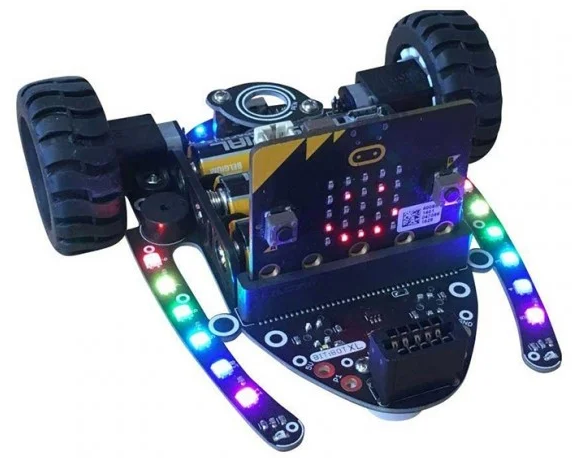

====================================================
BitBotXL
====================================================

This is for BitBot XL v1.1, 2020.
A more recent version, v1.2, has drive straight calibration using a downloadable hex file. See: https://4tronix.co.uk/blog/?p=2479. For the makecode github of its code see: https://github.com/4tronix/BitBot/blob/master/bitbot.ts

.. Warning::

    | v2 microbits are required for the module used here. 
    | v1 microbits lack the memory space required.

| For product info:
| See: https://shop.4tronix.co.uk/products/bitbotxl
| See: https://4tronix.co.uk/blog/?p=2479
| See: https://4tronix.co.uk/blog/?p=1490
| See: https://4tronix.co.uk/blog/?p=2317

| The 4tronix BitBOt XL has 2 independent motors, 2 digital line following sensors for line tracking, optional distance sensor for obstacle avoidance, 12 LEDs and a buzzer, all powered by 3 AAA batteries. 
| The servo outputs and 2 analog light sensors are not used here.

.. image:: images/ultrasonic-sensor-for-bitbot-xl.png
    :scale: 50 %
    :align: center
    :alt: HC_SR04P

| Dimensions 11cm x 12cm x 5.5cm (with vertical microbit)

Pins
---------

The pin numbers used to control different parts are below.

=======  ===========================
 Pin     Purpose
=======  ===========================
 pin0    Buzzer
 pin1    Right Light Sensor
 pin2    Left Light Sensor
 pin8    Left Motor Backward
 pin12   Right Motor Backward
 pin13   12x LEDs
 pin14   Right Motor
 pin15   Ultrasonic
 pin16   Left Motor
=======  ===========================

| I2C address 0x1c  (28)
| Left Line Sensor bit 0
| Right Line Sensor bit 1

