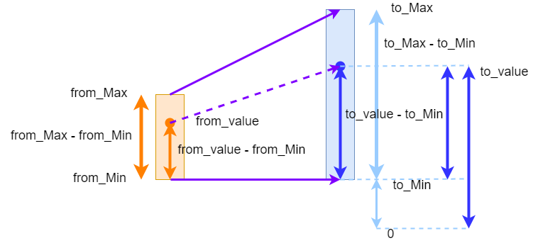

====================================================
MiniBit motors
====================================================

Pins for the motors are below.

=======  ===========================
 Pin     Purpose
=======  ===========================
 pin12   Left Motor
 pin8    Left Motor Backward

 pin14   Right Motor
 pin16   Right Motor Backward
=======  ===========================

----

Motor pin constants
----------------------------------------

| Set constants for the 4 motor pins.
| e.g. left motor forward ``LMF = pin12``

.. admonition:: Tasks

    #. Set constants for the 4 motor pins.

    .. dropdown::
        :icon: codescan
        :color: primary
        :class-container: sd-dropdown-container

        .. tab-set::

            .. tab-item:: Q1

                .. code-block:: python

                    from microbit import *

                    LMF = pin12
                    LMB = pin8
                    RMF = pin16
                    RMB = pin14
                        

----

Stop
----------------------------------------

| Use ``write_digital(0)`` to stop the motors controlled by each pin.

.. admonition:: Tasks

    #. Write code to stop all motors in a def block: ``def stop()``.

    .. dropdown::
        :icon: codescan
        :color: primary
        :class-container: sd-dropdown-container

        .. tab-set::

            .. tab-item:: Q1

                .. code-block:: python

                    from microbit import *

                    LMF = pin12
                    LMB = pin8
                    RMF = pin16
                    RMB = pin14

                    def stop():
                        LMF.write_digital(0)
                        LMB.write_digital(0)
                        RMF.write_digital(0)
                        RMB.write_digital(0)

                    stop()

----

Scaling speeds
---------------

| The miniBit motors take an analogue value of 0 to 1023 for their speed.
| Rather than specifying analogue speed from 0 to 1023, it may be more convenient to use a speed scale from 0 to 10.
| To do this use: ``int(((from_value - from_min) / (from_max - from_min)) * (to_max - to_min) + to_min)``.

.. py:function:: scale(from_value, from_min, from_max, to_min, to_max)

    | Returns a value, from_value, from a range of (from_min, from_max), to an equivalent value in a range of (to_min, to_max).

.. py:function:: speed_scaled(speed=2)

    | Converts a value from a range of (0, 10) to an equivalent value in the range (0, 1023).

| The code below converts a speed from a range of (0, 10) to an equivalent value in the range (0, 1023).

.. code-block:: python
    
    from microbit import *

    def scale(from_value, from_min, from_max, to_min, to_max):
        return int(((from_value - from_min) / (from_max - from_min)) * (to_max - to_min) + to_min)

    def speed_scaled(speed=2):
        return scale(speed, 0, 10, 0, 1023)

----

Drive forwards
----------------------------------------

| Drive the buggy forwards.
| Use a default speed as in ``def forwards(speed=2)``.
| Use ``write_analog(analog_speed)`` to drive the motor where analog_speed is from 0 to 1023.
| Use ``write_digital(0)`` to stop the other motors.
| If the motor drives forwards, the backwards pin should be sent ``write_digital(0)`` to turn it off.

.. admonition:: Tasks

    #. Write code to drive forwards using: ``def forwards(speed=2)``.

    .. dropdown::
        :icon: codescan
        :color: primary
        :class-container: sd-dropdown-container

        .. tab-set::

            .. tab-item:: Q1

                .. code-block:: python

                    from microbit import *

                    LMF = pin12
                    LMB = pin8
                    RMF = pin16
                    RMB = pin14

                    def scale(from_value, from_min, from_max, to_min, to_max):
                        return int(((from_value - from_min) / (from_max - from_min)) * (to_max - to_min) + to_min)

                    def speed_scaled(speed=2):
                        return scale(speed, 0, 10, 0, 1023)
                        
                    def forwards(speed=2):
                        analog_speed = speed_scaled(speed)
                        LMF.write_analog(analog_speed)
                        LMB.write_digital(0)
                        RMF.write_analog(analog_speed)
                        RMB.write_digital(0)

                    forwards(speed=2)

----

Drive backwards
----------------------------------------

| Drive the buggy backwards.
| Use a default speed as in ``def backwards(speed=2)``.
| Use ``write_analog(analog_speed)`` to drive the motor where analog_speed is from 0 to 1023.
| Use ``write_digital(0)`` to stop the other motors.
| If the motor drives backwards, the forwards pin should be sent ``write_digital(0)`` to turn it off.

.. admonition:: Tasks

    #. Write code to drive backwards using: ``def backwards(speed=2)``.

    .. dropdown::
        :icon: codescan
        :color: primary
        :class-container: sd-dropdown-container

        .. tab-set::

            .. tab-item:: Q1

                .. code-block:: python

                    from microbit import *

                    LMF = pin12
                    LMB = pin8
                    RMF = pin16
                    RMB = pin14

                    def scale(from_value, from_min, from_max, to_min, to_max):
                        return int(((from_value - from_min) / (from_max - from_min)) * (to_max - to_min) + to_min)

                    def speed_scaled(speed=2):
                        return scale(speed, 0, 10, 0, 1023)
                     
                    def backwards(speed=2):
                        analog_speed = speed_scaled(speed)
                        LMF.write_digital(0)
                        LMB.write_analog(analog_speed)
                        RMF.write_digital(0)
                        RMB.write_analog(analog_speed)

                    backwards(speed=2)

----

Turn left
----------------------------------------

| To turn left, stop the left motors and drive the right motors forwards or backwards.
| Use a default speed as in ``def left(speed=2, tightness=2)``.
| Use ``write_analog(analog_speed)`` to drive the motor where analog_speed is from 0 to 1023.
| If the speed is nagative, drive left backwards.
| Use ``write_digital(0)`` to stop the other motors.

.. admonition:: Tasks

    #. Write code to turn left using: ``def left(speed=2, tightness=2)``.

    .. dropdown::
        :icon: codescan
        :color: primary
        :class-container: sd-dropdown-container

        .. tab-set::

            .. tab-item:: Q1

                .. code-block:: python

                    from microbit import *

                    LMF = pin12
                    LMB = pin8
                    RMF = pin16
                    RMB = pin14

                    def scale(from_value, from_min, from_max, to_min, to_max):
                        return int(((from_value - from_min) / (from_max - from_min)) * (to_max - to_min) + to_min)

                    def speed_scaled(speed=2):
                        return scale(speed, 0, 10, 0, 1023)
                     
                    def left(speed=2, tightness=2):
                        LMF.write_digital(0)
                        LMB.write_analog(speed)
                        RMF.write_digital(0)
                        RMB.write_analog(speed)

                    backwards(speed=200)