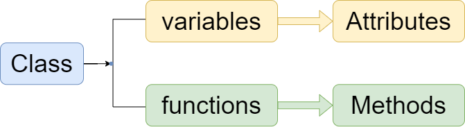

====================================================
Classes as objects
====================================================

| See: https://www.w3schools.com/python/python_classes.asp
| See: https://docs.python.org/3/tutorial/classes.html
| If using Mu editor, use python3 mode for the examples given.

----

Classes and Objects
----------------------

| Classes provide a means of bundling data and functionality together. 
| A Class is a code template or blueprint for creating instances (objects).
| An instance of a class is an object which has a collection of data (variables) and methods (functions) that act on those data.
| Each class instance can have attributes for data. 
| Each class instance can also have methods for modifying its data.

----

Object data and methods
-----------------------------

| Variables in a class are known as attributes.
| Functions in a class are known as methods.
