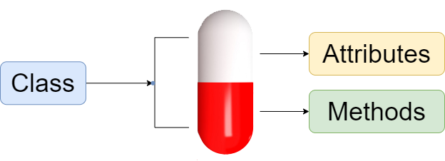

====================================================
Classes as objects
====================================================

| The examples given are for use in python3 mode in Mu editor and are not microbit specific.
| See: https://www.w3schools.com/python/python_classes.asp
| See: https://docs.python.org/3/tutorial/classes.html

----

Classes and Objects
----------------------

| A Class is a code template or blueprint for creating instances (objects).
| An instance of a class is an object which has a collection of data (variables) and methods (functions) that act on those data.

| Classes provide a means of bundling data and functionality together. 
| Each class instance can have attributes attached to it for maintaining its state. 
| Each class instance can also have methods for modifying its state.

----

Object data and methods
-----------------------------

| Variables in a class are known as attributes.
| Functions in a class are known as methods.

