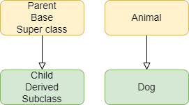

====================================================
Inheritance
====================================================

| The examples given are for use in python3 mode in Mu editor and are not microbit specific.
| See: https://www.w3schools.com/python/python_classes.asp

Class Inheritance
--------------------

| Inheritance is a way of reusing code by inheriting the structure from the parent class. 
| The parent class is also called the base class or super class. 
| The child class is also called the derived class or subclass.

------------------------------

.. image:: images/inheritance1.png
    :scale: 100 %
    :align: center
    :alt: Inheritance

---------------------------------

.. image:: images/inheritance2.png
    :scale: 100 %
    :align: center
    :alt: Inheritance

| Inheritance models an is-a relationship. 
| e.g A dog **is an** animal. The dog is a specialized version of an animal.
| Use Inheritance when the child classes have common features (variables/attributes and functions/methods) with the parent class.
| The child class inherits from the parent class.
| The child class can change (override) some features or add (extend) features without affecting the parent class.

| To create a child class from a parent class, place the name of the parent class in parentheses after the child class name. e.g ChildGame(ParentGame)

----

super
-----------

See https://realpython.com/python-super/

----

Multiple Class Inheritance
-----------------------------

| The code below shows an example multiple inheritance.
| The LevelSpeedGame class inherits from both classes: (LevelGame, SpeedGame.

.. code-block:: python

    class LevelGame:
        game_number = 0
        
        def __init__(self, level):
            self.level = level
            LevelGame.game_number += 1
            
        def increase_level(self):
            self.level += 1
            
    class SpeedGame:
        """game of speed"""
        def __init__(self, speed):
            self.speed = speed

        def set_speed(self, speed):
            self.speed = speed
            
    class LevelSpeedGame(LevelGame, SpeedGame):
        def __init__(self, level, speed):
            LevelGame.__init__(self, level)
            SpeedGame.__init__(self, speed)
            
    game = LevelSpeedGame(level=1, speed=10)
    print(game.level, game.game_number, game.speed)
    game2 = LevelSpeedGame(2, 20)
    print(game2.level, game2.game_number, game2.speed)

