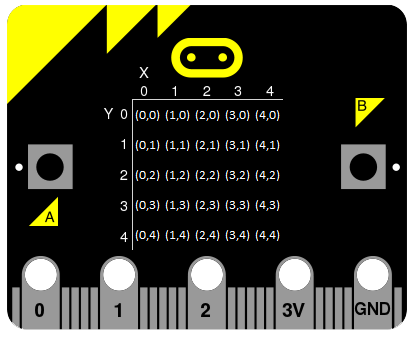

====================================================
Tilt Pixels game
====================================================

Game design
--------------------

| TiltPixels is a game to find hidden pixels on the display by titling the microbit.
| A class is used to run the game.
| A set will be used to keep track of the pixels visited by tilting.
| The (x,y) coordinates of each pixel are in the diagram below.

#. Set up the game object (initialize an instance of the class)
    a. Set between 2 and 10 random pixels to be found.
    b. Start from a random pixel and display it brightly then faintly.
#. Repeat the following steps:
    a. Use the accelerometer to detect a tilt and move the pixel.
    b. If all the pixels have been found then:
        #. Display the location of the hidden pixels as when as the visited pixels.
        #. Scroll the score.
        #. Set up the game object again and play again.

| The code uses the class, ``TiltPixels()``, for the game object.
| Only the ``run_game`` method is used outside the class itself.

| The code below omits the TiltPixels class for simplicity, but shows the rest of the game code.
| The while True loop repeats the game if both buttons have been pressed.

.. code-block:: python

    from microbit import *

    game = TiltPixels()
    game.run_game()
    while True:
        if button_a.was_pressed() and button_b.was_pressed():
            game = TiltPixels()
            game.run_game()
        else:
            sleep(2000)

----

The TiltPixels class
------------------------

| The ``TiltPixels`` class groups together the game attributes and game methods.

.. py:class:: TiltPixels()

    | Set up the game object to control the game, including the hidden and visited pixels.
    | Initial x, y values for the initial pixel could be passed here as an argument.
    | ``game = TiltPixels(2,2)`` would place the initial pixel in the center of the 5 by 5 grid.
    | There is no need to do so since the game has a constructor method to start at a random pixel.

| The code below imports the random module and creates the game object by creating an instance of the TiltPixels class.

.. code-block:: python

    from microbit import *
    import random

    game = TiltPixels()

----

The TiltPixels class methods
-------------------------------

| The TiltPixels class methods are described bwlow.

#. ``.pixels_to_get()`` creates a set of tuples of (x, y) coordinates for 2 to 10 hidden pixels.
#. ``.acc_x_change()`` returns -1 to move to the left, 0 for no change and 1 to move to the right.
#. ``.acc_y_change()`` returns -1 to move to the top, 0 for no change and 1 to move to the bottom.
#. ``.tilt()`` will move a bright pixel in the direction of tilt.
#. ``.prepare_move()`` updates the new pixel and adds it to the pixels_filled set.
#. ``.show()`` sets the brightness of the new pixel to bright, then dim.
#. ``.filled()`` will check if all the hidden pixels have been visited by tilting.
#. ``.answer()`` will display the hidden pixels brightly and the visited pixels dimly.
#. ``.score()`` will calculate the score.
#. ``.run_game()`` runs the game in full.
#. 
----

The TiltPixels constructor
---------------------------------

.. py:method:: __init__(x_position=random.randint(0, 4), y_position=random.randint(0, 4))

    | The __init__() method is the constructor called when the game object is created.
    | The starting pixel is at the coordinates: ``(x_position, y_position)``.
    | ``x_position`` is the starting x value which by default will be a random integer from 0 to 4.
    | ``y_position`` is the starting y value which by default will be a random integer from 0 to 4.

| ``self.x_position`` keeps track of the x position of the current pixel.
| ``self.y_position`` keeps track of the y position of the current pixel.
| ``self.tilt_sensitivity`` sets the amount of tilt needed to move the pixel.
| ``self.game_speed`` sets the sleep time between pixel moves.
| ``self.pixels_filled`` is initialized as a set with the starting pixel tuple: ``(x_position, y_position)``. A set is used to make it easy to keep track of the visited pixels. A set is used instead of a list because sets don't allow duplicate values to be stored. When the microbit is tilted, each pixel will be added to the set. 
| ``self.pixels_to_get`` stores the set of hidden pixels created using ``pixels_to_get()``. 
| ``self.show()`` displays the pixel at (x_position, y_position).

| The __init__ method is given below.

.. code-block:: python

    class TiltPixels:
        def __init__(self, x_position=random.randint(0, 4), y_position=random.randint(0, 4)):
            self.x_position = x_position
            self.y_position = y_position
            self.tilt_sensitivity = 100
            self.game_speed = 400
            self.pixels_filled = set((x_position, y_position))
            self.pixels_to_get = self.pixels_to_get()
            self.show()

----

The hidden pixels
---------------------------------

.. py:method:: pixels_to_get()

    | Create a set of tuples of (x, y) coordinates for 2 to 10 hidden pixels.
    | e.g with 5 pixels: {(2, 1), (4, 1), (3, 4), (2, 0), (1, 1)}

| The decorator ``@staticmethod``, makes the function a static method. This utility function doesn't access any properties of the class. No reference to ``self`` is passed to it.
| ``pixels = set()`` creates an empty set.
| ``pixels.add((x, y))`` adds a tuple of x and y values to the set. These are the coordinates of each hidden pixel to find.
| ``for _ in range(random.randint(2, 10))`` controls the number of pixels to find. There will be a random number of pixels, from 2 to 10 pixels, to find. 
| ``_`` is used by convention when the iterator variable is not needed in the for-loop body.

.. code-block:: python

    class TiltPixels:
        ...

        @staticmethod
        def pixels_to_get():
            pixels = set()
            for _ in range(random.randint(2, 10)):
                x = random.randint(0, 4)
                y = random.randint(0, 4)
                pixels.add((x, y))
            return pixels

----

Accelerometer
---------------------------------

.. py:method:: acc_x_change()

    | Return an integer that will be used to move the pixel left or right.
    | Values are: -1 to move to the left, 0 for no change and 1 to move to the right.
    | A sensitivity of 100 can be exceeded with a small tilt.

.. code-block:: python

    class TiltPixels:
        ...

        def acc_x_change(self):
            sensitivity = self.tilt_sensitivity
            accx = accelerometer.get_x()
            if accx < -sensitivity:
                xd = -1
            elif accx > sensitivity:
                xd = 1
            else:
                xd = 0
            return xd

----

.. py:method:: acc_y_change()

    | Return an integer that will be used to move the pixel left to right.
    | Values are: -1 to move to the top, 0 for no change and 1 to move to the bottom.
    | A sensitivity of 100 can be exceeded with a small tilt.

.. code-block:: python

    class TiltPixels:
        ...

        def acc_y_change(self):
            sensitivity = self.tilt_sensitivity
            accy = accelerometer.get_y()
            if accy < -sensitivity:
                yd = -1
            elif accy > sensitivity:
                yd = 1
            else:
                yd = 0
            return yd

----

Tilt
---------------------------------

| The ``while True`` loop calls ``game.tilt()``
| This gets the change in the x and y coordinates from tilting.
| The new pixel is stored in the set, ``pixels_filled``.
| The new pixel is then shown brightly, then dimly.

.. py:method:: tilt()

    | Calls the **prepare_move** method and the **show** method.

.. code-block:: python

    class TiltPixels:
        ...

        def tilt(self):
            self.prepare_move(self.acc_x_change(),self.acc_y_change())
            self.show()

----

Prepare move
~~~~~~~~~~~~~~~~

.. py:method:: prepare_move(x_delta, y_delta)

    | Updates the x_position and y_position values for the new pixel and adds it to the pixels_filled set.
    | x_delta is the integer returned from ``acc_x_change()``.
    | y_delta is the integer returned from ``acc_y_change()``.

| The min and max functions are used to restrict the new x and y values to 0 to 4.
| ``pixels_filled.add((self.x_position, self.y_position)`` adds the new tuple (x, y) to the set ``pixels_filled``. Because sets can't include duplicate values, any previously visited pixels are only stored once.

.. code-block:: python

    class TiltPixels:
        ...

        def prepare_move(self, x_delta, y_delta):
            self.x_position = min(4, max(0, self.x_position + x_delta))
            self.y_position = min(4, max(0, self.y_position + y_delta))
            self.pixels_filled.add((self.x_position, self.y_position))

----

Show
~~~~~~~~~~~~~~~~

.. py:method:: show()

    | Set the brightness of the new pixel to 9, then 2.

.. code-block:: python

    class TiltPixels:
        ...

        def show(self):
            display.set_pixel(self.x_position, self.y_position, 9)
            sleep(50)
            display.set_pixel(self.x_position, self.y_position, 2)

----

Filled
---------------------------------

| After moving to a new pixel, check to see if all the hidden pixels have been found.

.. py:method:: filled()

    | Returns True if all the hidden pixels have been visited, or False if not.
    | It uses the issubset method to check if the tall the values in teh set pixels_to_get are in teh set pixels_filled.

.. code-block:: python

    class TiltPixels:
        ...

        def filled(self):
            return self.pixels_to_get.issubset(self.pixels_filled)
    
----

Answer and score
---------------------------------

| If all the hidden pixels have been found, display the hidden pixels brightly while keeping all the visited pixels displayed dimly.

.. py:method:: answer()

    | Loop through the set of hidden pixels and set their brightness to 9.

.. py:method:: score()

    | Return the game score by finding the difference between the number of pixels visited and the number of hidden pixels.
    | The lower the number the better. The best score is 0 and the worst score possible is 23 if all pixels were visited and there were only 2 hidden.

.. code-block:: python

    class TiltPixels:
        ...

        def answer(self):
            # display.clear()
            for i in self.pixels_to_get:
                display.set_pixel(i[0], i[1], 9)
            sleep(2000)
        
        def score(self):
            return len(self.pixels_filled) - len(self.pixels_to_get)
    
----

Run game
---------------------------------

| Use the accelerometer to detect a tilt and move the pixel.
| If all the pixels have been found then:
| Display the location of the hidden pixels as well as the visited pixels.
| Scroll the score.

.. py:method:: run_game()

    | Turn on pixels as teh microbit is tilted until the hidden pixels are found.

.. code-block:: python

    class TiltPixels:
        ...

    def run_game(self):
        game_over = False
        while game_over is False:
            self.tilt()
            sleep(self.game_speed)
            if self.filled():
                game_over = True
                self.answer()
                display.scroll(self.score())
    
----

Game code
---------------------------------

| The game code is below.

.. code-block:: python

    """TiltPixels game: tilt to find the hidden pixels"""

    from microbit import *
    import random

    class TiltPixels:
        def __init__(self, x_position=random.randint(0, 4), y_position=random.randint(0, 4)):
            self.x_position = x_position
            self.y_position = y_position
            self.tilt_sensitivity = 100
            self.game_speed = 400
            self.pixels_filled = set((x_position, y_position))
            self.pixels_to_get = self.pixels_to_get()
            self.show()

        @staticmethod
        def pixels_to_get():
            pixels = set()
            for _ in range(random.randint(2, 10)):
                x = random.randint(0, 4)
                y = random.randint(0, 4)
                pixels.add((x, y))
            return pixels

        def answer(self):
            # display.clear()
            for i in self.pixels_to_get:
                display.set_pixel(i[0], i[1], 9)
            sleep(2000)

        def filled(self):
            return self.pixels_to_get.issubset(self.pixels_filled)
        
        def score(self):
            return len(self.pixels_filled) - len(self.pixels_to_get)
        
        def prepare_move(self, x_delta, y_delta):
            self.x_position = min(4, max(0, self.x_position + x_delta))
            self.y_position = min(4, max(0, self.y_position + y_delta))
            self.pixels_filled.add((self.x_position, self.y_position))

        def show(self):
            display.set_pixel(self.x_position, self.y_position, 9)
            sleep(50)
            display.set_pixel(self.x_position, self.y_position, 2)

        def acc_x_change(self):
            sensitivity = self.tilt_sensitivity
            accx = accelerometer.get_x()
            if accx < -sensitivity:
                xd = -1
            elif accx > sensitivity:
                xd = 1
            else:
                xd = 0
            return xd

        def acc_y_change(self):
            sensitivity = self.tilt_sensitivity
            accy = accelerometer.get_y()
            if accy < -sensitivity:
                yd = -1
            elif accy > sensitivity:
                yd = 1
            else:
                yd = 0
            return yd
            
        def tilt(self):
            self.prepare_move(self.acc_x_change(),self.acc_y_change())
            self.show()

        def run_game(self):
            game_over = False
            while game_over is False:
                self.tilt()
                sleep(self.game_speed)
                if self.filled():
                    game_over = True
                    self.answer()
                    display.scroll(self.score())

    game = TiltPixels()
    game.run_game()
    while True:
        if button_a.was_pressed() and button_b.was_pressed():
            game = TiltPixels()
            game.run_game()
        else:
            sleep(2000)

----

.. admonition:: Tasks

    #. Modify the code to use a button press to peek at the answer for half a second while still playing the game.
    #. Write code to store all the game scores and display the average score with a button press.
    #. Write code to use the A and B buttons to adjust the game speed in steps of about 100.
    #. Add a default parameter to the __init__ method for the game speed and use a for loop to increment the game speed from 200 to 500 in steps of 100 so that only 4 games are played.

