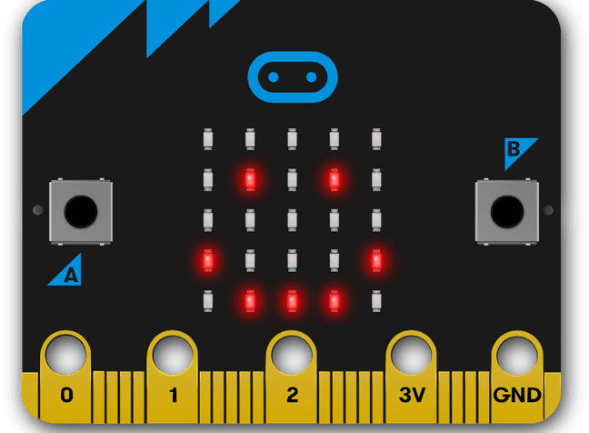

====================================================
Introduction
====================================================

PC-Microbit-extension documentation
----------------------------------------

.. admonition:: Tip
    
    If you are using a trackpad, navigate to various sections and pages by clicking on the same heading in the left sidebar twice, then use the arrow keys to move up and down.

| These docs will help you code your microbit using micropython.
| This is an extension to https://pc-microbit-micropython.readthedocs.io/en/latest/index.html.

----

Home pages:
---------------------

| https://pc-microbit-micropython.readthedocs.io/en/latest/index.html
| https://pc-microbit-extension.readthedocs.io/en/latest/index.html
| https://pc-python.readthedocs.io/en/latest/index.html

----

Key references:
---------------------

| python: https://www.w3schools.com/python/
| microbit: https://microbit-micropython.readthedocs.io/en/v2-docs/index.html

----

Microbit software:
---------------------

Comparison of microbit programming options:

The Mu editor for laptops, https://codewith.mu/en/tutorials/1.1/microbit, is the first choice for coding on the microbit.

The standard micropython editor: https://python.microbit.org/v/2 is an online editor consistent with Mu editor.

Edublocks, https://app.edublocks.org/#MicroBit, is an online editor with both blocky code and micropython consistent with Mu editor, and can display the block code and micropython code side by side.

Microbit software with simulators:
----------------------------------------

Create with code UK, https://create.withcode.uk/, works with standard python or micropython. Starting the code with "from microbit import /*" will pop up the simulator when the code is run.

The Makecode website https://makecode.microbit.org/ allows blocky code use, but it has its own unique version of micropython based on its own translation of the typescript code that it uses, and so it will not work with Mu editor or the standard online micropython editor. It has an excellent simulator and vast extensions library for exploring other devices that can be connected to the microbit.

----

References:
------------------

* https://microbit-micropython.readthedocs.io/en/v2-docs/index.html
* https://microbit-micropython.readthedocs.io/en/latest/index.html
* https://microbit-challenges.readthedocs.io/en/latest/index.html
* http://multiwingspan.co.uk/micro.php (no access from school)
* https://microbit.pinout.xyz/pin-3v-power.html

----

For beginners, using blocky code, these sites may be useful:

* https://microbit.org/projects/make-it-code-it/?filters=python

----

Python references:
------------------

For an introduction to python see:

* https://www.w3schools.com/python/default.asp
* https://www.netjstech.com/p/python-tutorial.html
* https://www.programiz.com/python-programming
* https://www.pythontutorial.net/
* https://docs.python.org/3.9/tutorial/introduction.html

